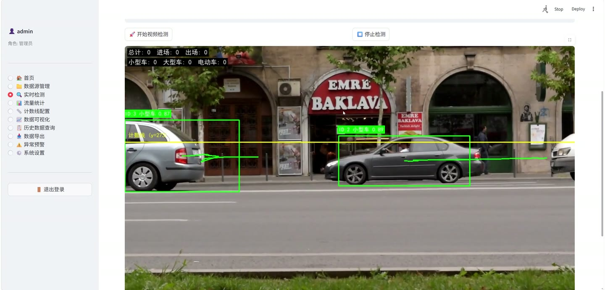
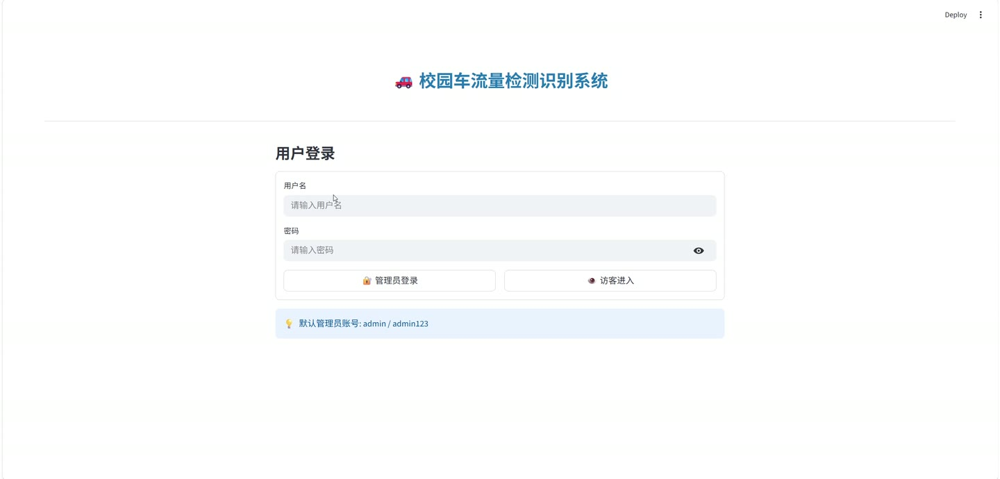
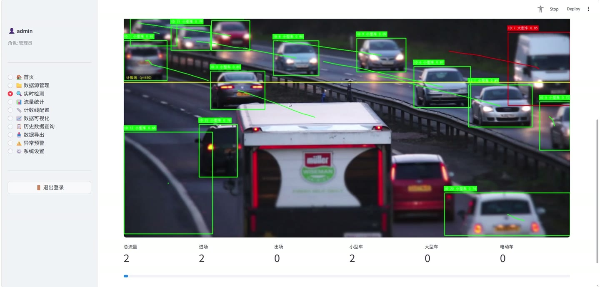
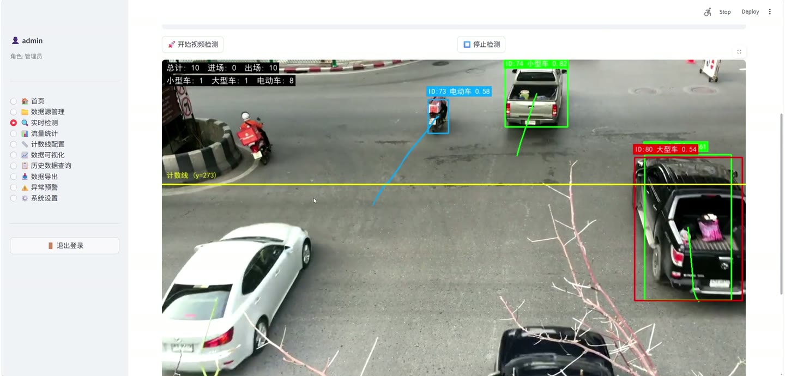
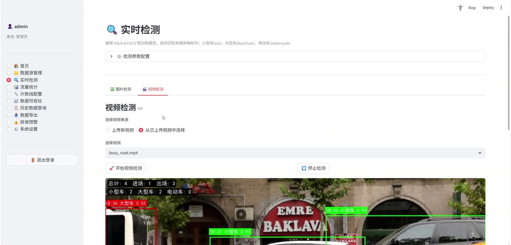
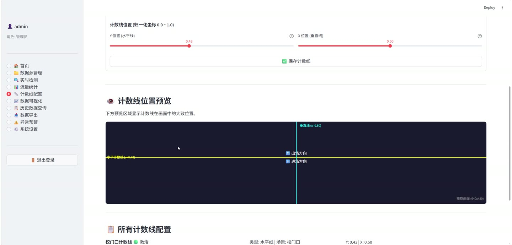

# (附文档)Python+YOLO+深度学习 基于YOLOv8的校园车流量检测识别系统

**技术栈**：Python、PyTorch、YOLO、深度学习

### 系统简介

本系统是一套基于 YOLOv8 深度学习模型的校园车流量检测识别系统，采用 Python + Streamlit 构建前端交互界面，后端集成 PyTorch 推理引擎与 SQLite 数据库，实现从视频/摄像头数据源接入、实时车辆检测跟踪、流量统计、数据可视化到异常预警的完整闭环。系统区分管理员与访客两种角色，管理员拥有全部功能权限，访客仅可查看检测与统计相关页面。
 
### 核心功能
 
### 管理员端

 
- 数据源管理：支持上传本地视频文件或配置摄像头 RTSP 流地址，统一管理检测数据源列表。 
- 实时检测：调用 YOLOv8 模型对视频帧进行逐帧推理，识别小型车、大型车、电动车三类目标并绘制检测框。 
- 目标跟踪：集成 ByteTrack 算法对检测到的车辆进行多目标跟踪，分配唯一轨迹 ID，避免重复计数。 
- 计数线配置：支持水平线、垂直线及自定义折线三种计数线类型，通过归一化坐标设置计数线位置。 
- 流量统计：基于计数线穿越事件统计各时段车流量，按小型车、大型车、电动车分类汇总。 
- 数据可视化：使用 ECharts 渲染车流量趋势图、类别占比饼图等图表，直观展示流量变化。 
- 历史数据查询：按时间范围、车辆类别等条件检索历史检测记录与流量统计数据。 
- 数据导出：将检测结果与统计数据导出为文件，便于离线分析与存档。 
- 异常预警：设置车流量预警阈值，当单位时间流量超过阈值时触发预警提示。 
- 系统设置：调整置信度阈值、IoU 阈值、图像尺寸等模型推理参数以及预警相关配置。 
- 用户认证：通过用户名密码登录后台，默认管理员账号 admin，登录后进入管理主界面。
 
### 访客端

 
- 免密进入：点击访客进入按钮即可浏览系统，无需输入账号密码。 
- 实时检测查看：可查看 YOLOv8 实时车辆检测画面与识别结果。 
- 流量统计查看：可浏览各时段车流量统计汇总数据。 
- 数据可视化查看：可查看 ECharts 渲染的车流量趋势图与类别分布图。 
- 历史数据查询：可按条件检索历史检测与流量记录。 
- 权限隔离：访客无法访问数据源管理、计数线配置、数据导出、异常预警及系统设置等管理功能。
 
### 技术栈

 开发语言Python 深度学习框架PyTorch 目标检测模型YOLOv8（yolov8n.pt 预训练权重） 目标跟踪算法ByteTrack 前端框架Streamlit 可视化图表ECharts 数据库SQLite 图像处理OpenCV 类别体系COCO 预训练类别映射为小型车/大型车/电动车三分类
 
### 交付内容

 
- 后端完整源码 
- 前端完整源码 
- 数据库初始化脚本 
- 万字文档

## 界面展示

---

## 获取完整源码 + 万字文档

本仓库为项目介绍页。**完整前后端源码、数据库初始化脚本、万字项目文档**，请加微信 `kangkangcode`，或访问 [codekk.top](http://codekk.top) 获取。

可作课程设计 / 毕业设计参考，支持远程部署调试。